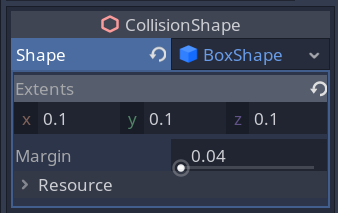

# 3D - TOP DOWN SHOOTER GAME

## 1: Look at me

* Ray casting using `project_ray_origin` and `project_ray_normal`.
* Getting ray intersection with the world.
* Looking at me using `look_at`

## 2: Gun System

Input Maps: W, A, S, D

`Project > Project Settings > Input Map`

Short cut keys for working in Godot

* W - Translate
* E - Rotate
* R - Scale
* Ctrl + D - Duplicate

Material for Gun:

* Spatial Material
* Albedo - color

Add a `Node` to the `Player` node which will act as a gun controller. It will control which weapons are equipped. Attach a script to it.

* Starting weapon - `PackedScene`
* Hand - `Position3D` child node of the body.
* `add_child()`

> Note: Scenes when instanced turns to nodes.

### Projectiles

* Bullet Scene is just a `Spatial` node with `MeshInstance`.
* Attach a script to Gun scene for bullet fire system.
* Add a `Position3D` to muzzle of the gun. It will act as marker from where the bullets are shot.
* To get a node in godot: `get_node("/root/Level")`
* Add an input map in `GunController`.

## 3: Enemies

* Scene - `KinematicBody`
* Body - `MeshInstance`
* Hit box - `CollisionShape`

Add collision related nodes to bullet scenes.

* `CollisionShape` can only be used with nodes which are derived from `CollisionObject`. Hence, add `Area` node to bullet.
* Change the extent of the collision shape.
* Connect the body entered signal to handle collisions.
* Queue free the bullets which hits the enemy.

* Add navigation mesh instance.
* Add the code for tracking the player.

### Killing Enemies

* Create a stats scene, just a `Node` which can be dropped inside player or enemies to track hitpoints.

* Stats node have a function `take_hit(damage: float)` which subtracts damage from current HP. When the HP is less than zero it sends a `die` signal (custom signal) to parent node, which the parent nodes need to handle.
